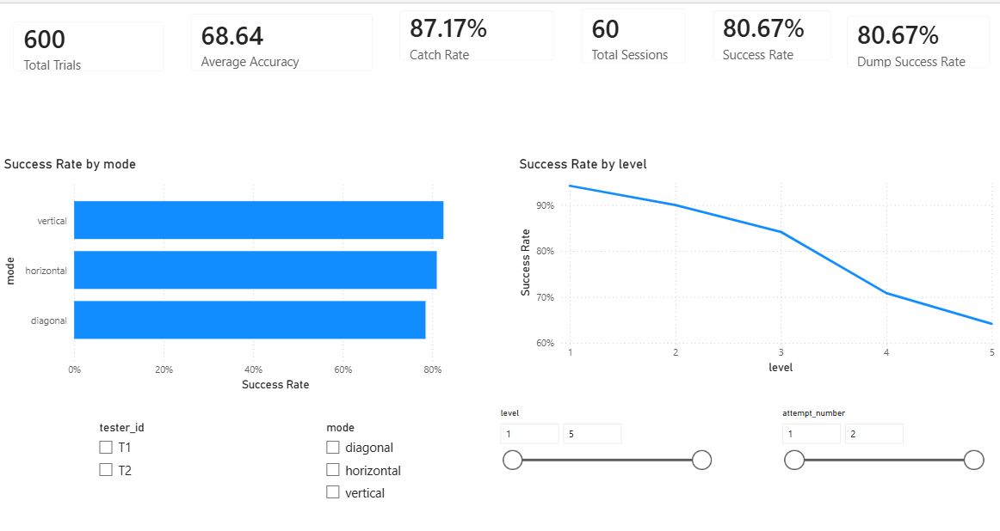
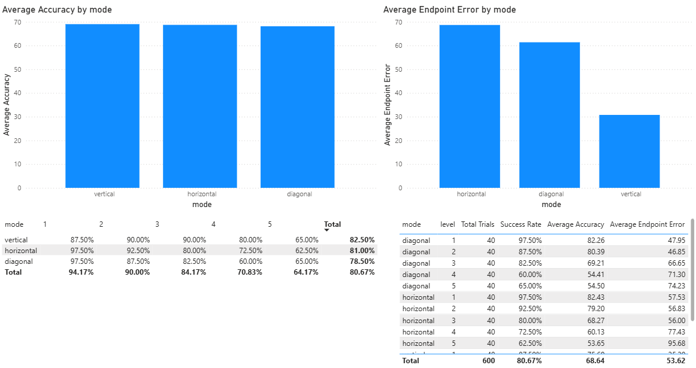
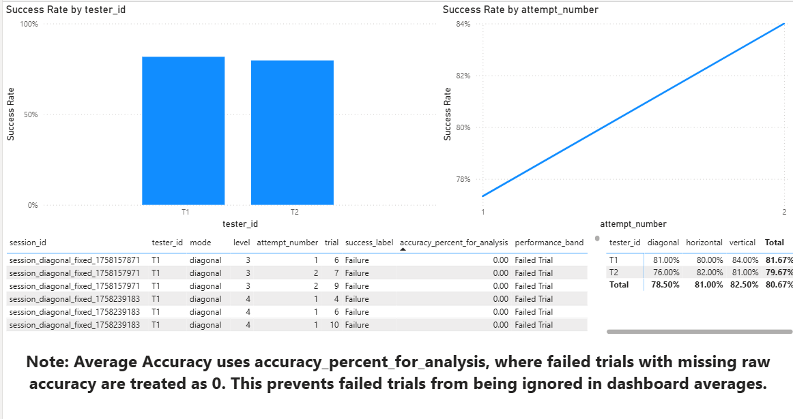
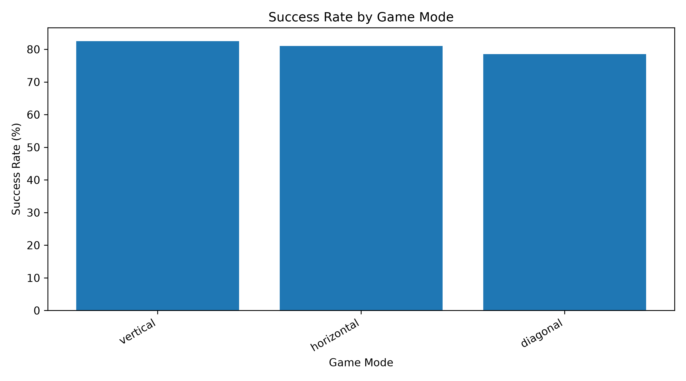
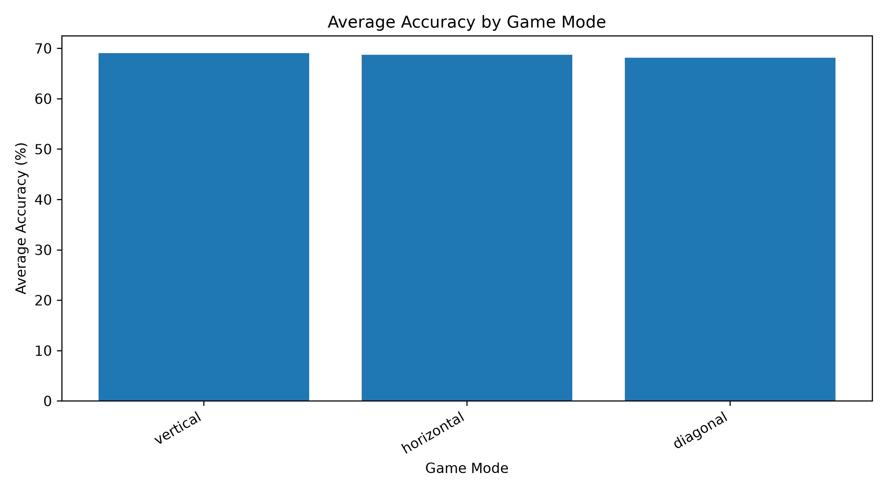
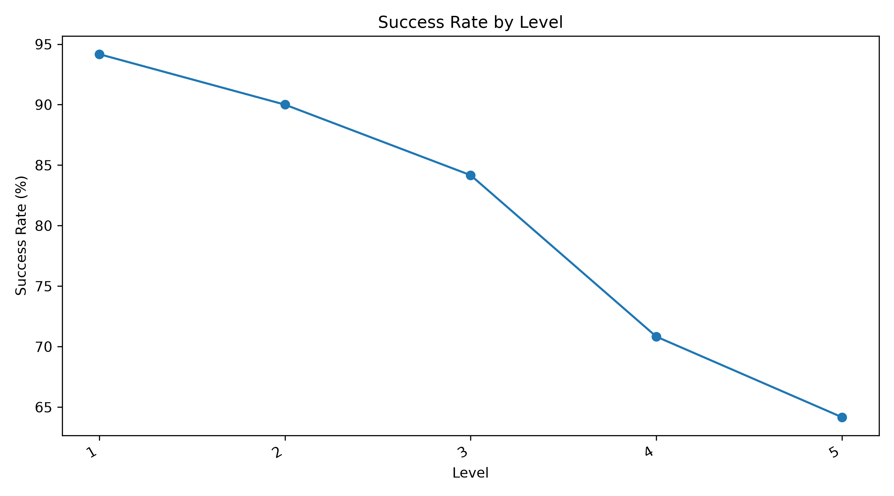
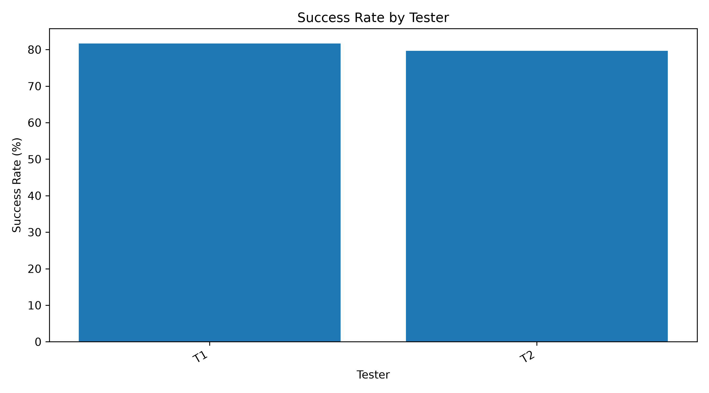
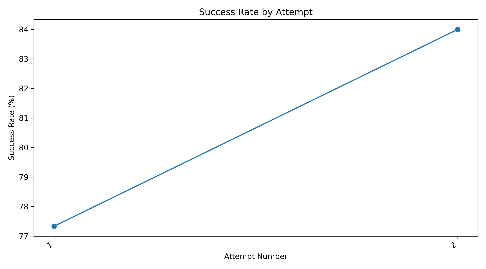

# Exer-Game for Stroke Rehabilitation (Webcam ExerGame)

A Python-based rehabilitation exergame that uses a webcam and MediaPipe hand tracking to control an on-screen “cup” and catch a moving ball. The game supports multiple movement patterns, adjustable difficulty, automatic level up/down, session logging, and performance tracking across sessions.

This project also includes a data analytics extension that turns the fixed-game session logs into cleaned datasets, KPI summary tables, SQL analysis, Python charts, and a Power BI dashboard.

> **Disclaimer:** This is a research and educational prototype and **not a medical device**. It does not replace clinical advice or supervised therapy.

---

## Table of Contents

* [Features](#features)
* [Project Structure](#project-structure)
* [Requirements](#requirements)
* [Installation](#installation)
* [Run the Game](#run-the-game)
* [How to Play](#how-to-play)
* [Game Modes](#game-modes)
* [Difficulty and Progression](#difficulty-and-progression)
* [Data Logging](#data-logging)
* [Data Analytics Extension](#data-analytics-extension)
* [Analytics Dataset](#analytics-dataset)
* [Analytics Workflow](#analytics-workflow)
* [Key Analysis Findings](#key-analysis-findings)
* [Dashboard Preview](#dashboard-preview)
* [Python-Generated Charts](#python-generated-charts)
* [Analytics Files](#analytics-files)
* [Healthy Benchmarks](#healthy-benchmarks)
* [Optional Personalized ML Model](#optional-personalized-ml-model)
* [Troubleshooting](#troubleshooting)
* [Safety Notes](#safety-notes)
* [Skills Demonstrated](#skills-demonstrated)
* [Credits](#credits)
* [Author](#author)
* [Demonstration Link](#demonstration-link)

---

## Features

* Real-time webcam hand tracking using MediaPipe and OpenCV
* Interactive gameplay and menus using PyGame
* Six game modes:
  * Horizontal Random Game
  * Vertical Random Game
  * Diagonal Random Game
  * Horizontal Fixed Workout Game
  * Vertical Fixed Workout Game
  * Diagonal Fixed Workout Game
* Difficulty levels from 1 to 5
* Automatic level up/down based on performance
* Session logging through CSV files
* Rolling recent-session history stored in JSON files
* Healthy benchmark support for comparison
* Optional personalized machine learning model using RandomForest
* Data analytics workflow for evaluating fixed-game performance
* SQL analysis and Power BI dashboard for performance reporting

---

## Project Structure

```text
Exer-Game-for-Stroke-Rehabilitaion/
  data/
    benchmark/
      healthy_benchmarks.json
      averageScript.py

    metadata/
      file_inventory.csv
      session_metadata.csv

    processed/
      fixed_game_trial_results.csv
      fixed_game_trial_results_cleaned.csv
      fixed_game_session_summary.csv
      fixed_game_mode_level_summary.csv
      fixed_game_tester_mode_summary.csv
      fixed_game_attempt_summary.csv
      data_quality_report.txt
      data_quality_issues.csv

    <user_name>/
      session_<game_type>_<timestamp>.csv
      <game_type>_history.json
      model_<game_type>.pkl
      scaler_<game_type>.pkl
      columns_<game_type>.txt

  dashboard/
    screenshots/
      overall_performance_dashboard.png
      mode_difficulty_dashboard.png
      tester_attempt_dashboard.png
      success_rate_by_mode.png
      average_accuracy_by_mode.png
      success_rate_by_level.png
      success_rate_by_tester.png
      attempt_success_rate.png

    stroke_rehab_fixed_game_dashboard.pbix

  docs/
    analysis_report.md
    data_dictionary.md
    kpi_definitions.md
    project_summary.md

  sql/
    01_create_table.sql
    03_validation_queries.sql
    04_analysis_queries.sql

  models/
    model.py

  src/
    creation_files/
      create_file_inventory.py
      create_session_metadata_template.py
      combine_session_files.py
      validate_and_clean_trial_results.py
      create_kpi_summary_tables.py
      create_eda_report.py

    game/
      main.py
      login.py
      horizontalRandomGame.py
      verticalRandomgame.py
      diagonalRandomGame.py
      horizontalFixedGame.py
      verticalFixedGame.py
      diagonalFixedGame.py

    images/
    music/

  requirements.txt
  README.md
```

---

## Requirements

* Python 3.9 or higher recommended
* A working webcam
* Power BI Desktop for the dashboard
* PostgreSQL for SQL analysis

Python packages used by this project include:

* `pygame`
* `opencv-python`
* `mediapipe`
* `numpy`
* `pandas`
* `matplotlib`
* `tabulate`
* `scikit-learn`
* `joblib`

> If MediaPipe fails to install on your Python version, try Python 3.10 or 3.11.

---

## Installation

### 1. Clone the repository

```bash
git clone https://github.com/Enyetullah/Exer-Game-for-Stroke-Rehabilitaion.git
cd Exer-Game-for-Stroke-Rehabilitaion
```

### 2. Create and activate a virtual environment

Windows:

```bash
python -m venv venv
venv\Scripts\activate
```

macOS or Linux:

```bash
python3 -m venv venv
source venv/bin/activate
```

### 3. Install dependencies

If a `requirements.txt` file is available, run:

```bash
pip install -r requirements.txt
```

If not, install the required packages manually:

```bash
pip install pygame opencv-python mediapipe numpy pandas matplotlib tabulate scikit-learn joblib
```

---

## Run the Game

From the repository root, run:

```bash
python src/game/main.py
```

### What happens when the game starts

1. A login screen appears.
2. The user enters a username.
3. The game creates a folder for that user under:

```text
data/<user_name>/
```

4. The user selects a game mode and difficulty.
5. The session begins.
6. Session data is saved automatically after gameplay.

---

## How to Play

1. Sit or stand in front of the webcam.
2. Use good lighting so the webcam can detect the hand clearly.
3. Keep the hand visible to the camera.
4. The tracked hand controls the in-game cup.
5. Move the cup to catch the moving ball.

### Controls

* **ESC**: Exit current mode or return to the menu
* **ENTER**: Continue or start the next session after a session ends

The main control method is the player’s hand position detected by the webcam.

---

## Game Modes

The project includes both random games and fixed workout games.

### Random Games

Random games provide varied practice and can optionally use a trained machine learning model to influence target spawning.

Random game modes include:

* Horizontal Random Game
* Vertical Random Game
* Diagonal Random Game

If a trained model exists for the user and game type, random modes may use it to predict a likely target zone and bias where the next ball appears.

### Fixed Workout Games

Fixed workout games follow structured movement patterns and are useful for consistent practice, testing, and benchmarking.

Fixed workout modes include:

* Horizontal Fixed Workout
* Vertical Fixed Workout
* Diagonal Fixed Workout

The fixed modes are especially useful for collecting repeatable data because the structure of the tasks is more controlled.

---

## Difficulty and Progression

The game supports difficulty levels from 1 to 5.

In general:

* Level 1 is the easiest.
* Level 5 is the hardest.
* Higher levels increase the challenge through speed, timing, target behavior, or movement requirements.

The system can automatically adjust difficulty based on performance:

* Strong performance may increase the difficulty level.
* Weak performance may decrease the difficulty level.

This allows the game to adapt to the user’s performance over time.

---

## Data Logging

Session logs are saved under:

```text
data/<user_name>/
```

Each session produces a CSV file such as:

```text
session_<game_type>_<timestamp>.csv
```

Typical fields may include:

| Field | Description |
|---|---|
| timestamp | Time when the trial was recorded. |
| trial | Trial number within the session. |
| ball_x | Ball x-coordinate. |
| cup_x | Cup x-coordinate. |
| zone | Target zone for the trial. |
| caught | Whether the ball was caught. |
| dump_success | Whether the dump action was successful. |
| success | Overall success result. |
| difficulty | Difficulty level. |
| game_type | Game mode and version. |
| accuracy | Accuracy value when available. |
| trail | Recorded movement trail coordinates. |

Each game mode also maintains a rolling history JSON file, such as:

```text
horizontal_random_history.json
vertical_fixed_history.json
diagonal_fixed_history.json
```

These history files store recent session results and can be used for progress review.

---

## Data Analytics Extension

In addition to the playable rehabilitation game, this project includes a data analytics extension focused on the fixed workout game modes.

The purpose of the analytics extension is to evaluate user performance across:

* game modes
* difficulty levels
* testers
* repeated attempts
* success and failure outcomes
* movement accuracy
* endpoint error
* tracking consistency

This turns the project from only a rehabilitation game prototype into a complete data analytics project using real application-generated data.

---

## Analytics Dataset

The analytics dataset was created from fixed-game session CSV logs.

The cleaned dataset contains:

| Metric | Value |
|---|---:|
| Total Trial Rows | 600 |
| Total Sessions | 60 |
| Total Testers | 2 |
| Total Game Modes | 3 |
| Successful Trials | 484 |
| Failed Trials | 116 |
| Overall Success Rate | 80.67% |
| Overall Failure Rate | 19.33% |
| Overall Catch Rate | 87.17% |
| Overall Dump Success Rate | 80.67% |
| Average Accuracy for Analysis | 68.64% |

The analytics data includes horizontal, vertical, and diagonal fixed-game modes across five difficulty levels.

Tester identities are anonymized using labels such as:

```text
T1
T2
```

This protects tester privacy while still allowing performance comparison.

---

## Analytics Workflow

### 1. File Inventory

A file inventory was created to document all raw session files and history files.

The inventory includes:

* file name
* game mode
* file type
* relative file path
* notes

### 2. Session Metadata

A session metadata file was created to label each session file with:

* tester ID
* game mode
* difficulty level
* attempt number
* game version
* include/exclude status

This made it possible to compare performance by tester, mode, level, and repeated attempt.

### 3. Master Trial-Level Dataset

All separate session CSV files were combined into one master trial-level dataset.

Each row represents one game trial.

The combined dataset includes:

* session information
* tester information
* game mode
* difficulty level
* attempt number
* trial result
* accuracy
* endpoint error
* movement trail data

### 4. Data Cleaning and Validation

The cleaned dataset was validated for:

* missing required fields
* invalid tester IDs
* invalid game modes
* invalid levels
* invalid attempt numbers
* invalid success values
* duplicate session/trial pairs
* level and difficulty mismatches
* mode and game type mismatches

The validation process found:

| Validation Check | Result |
|---|---:|
| Rows with data quality issues | 0 |
| Duplicate session/trial pairs | 0 |
| Rows missing raw accuracy | 77 |

The missing raw accuracy values appeared in failed trials. For dashboard analysis, an analysis-ready field called `accuracy_percent_for_analysis` was created.

This field treats failed trials with missing raw accuracy as `0` so failed trials are not ignored in average accuracy calculations.

### 5. KPI Summary Tables

Several KPI summary tables were created:

| File | Purpose |
|---|---|
| `fixed_game_session_summary.csv` | One row per session file. |
| `fixed_game_mode_level_summary.csv` | Performance by mode and level. |
| `fixed_game_tester_mode_summary.csv` | Performance by tester and mode. |
| `fixed_game_attempt_summary.csv` | Performance by tester, mode, level, and attempt. |

### 6. Python Exploratory Data Analysis

Python was used to calculate performance metrics, generate charts, and create an analysis report.

The analysis included:

* overall success rate
* success rate by game mode
* average accuracy by game mode
* success rate by level
* success rate by tester
* success rate by attempt

### 7. SQL Analysis

PostgreSQL was used to validate the cleaned data and perform SQL-based analysis.

The SQL queries answer questions such as:

* What is the overall success rate?
* Which game mode performed best?
* Which level was hardest?
* Which tester performed better?
* Did performance improve from Attempt 1 to Attempt 2?
* Which zones had the highest failure rate?
* Which mode-level combination was hardest?

### 8. Power BI Dashboard

A Power BI dashboard was created to visualize the main performance metrics.

The dashboard includes:

* KPI cards
* success rate by mode
* success rate by level
* average accuracy by mode
* tester comparison
* attempt comparison
* mode-level difficulty matrix
* filters for tester, mode, level, and attempt

---

## Key Analysis Findings

### Overall Performance

The fixed-game dataset contained 600 trial rows and 60 sessions.

Out of 600 trials:

| Result | Count |
|---|---:|
| Successful Trials | 484 |
| Failed Trials | 116 |

The overall success rate was **80.67%**.

---

### Game Mode Performance

| Game Mode | Success Rate |
|---|---:|
| Vertical | 82.5% |
| Horizontal | 81.0% |
| Diagonal | 78.5% |

Vertical mode had the highest success rate, while diagonal mode had the lowest success rate.

---

### Difficulty Level Performance

| Level | Success Rate |
|---|---:|
| Level 1 | 94.17% |
| Level 2 | 90.00% |
| Level 3 | 84.17% |
| Level 4 | 70.83% |
| Level 5 | 64.17% |

The results show that success rate decreased as difficulty level increased.

---

### Tester Performance

| Tester | Success Rate |
|---|---:|
| T1 | 81.67% |
| T2 | 79.67% |

Tester T1 had a slightly higher success rate than Tester T2.

---

### Attempt Improvement

| Attempt | Success Rate |
|---|---:|
| Attempt 1 | 77.33% |
| Attempt 2 | 84.00% |

Attempt 2 improved by **6.67 percentage points** compared with Attempt 1.

---

### Hardest Mode-Level Combination

The hardest mode-level combination was **diagonal Level 4**, with a success rate of **60.0%**.

---

## Dashboard Preview

### Overall Performance Dashboard



### Mode and Difficulty Dashboard



### Tester and Attempt Dashboard



---

## Python-Generated Charts

### Success Rate by Game Mode



### Average Accuracy by Game Mode



### Success Rate by Level



### Success Rate by Tester



### Success Rate by Attempt



---

## Analytics Files

| File | Description |
|---|---|
| `data/metadata/file_inventory.csv` | Inventory of raw session and history files. |
| `data/metadata/session_metadata.csv` | Metadata linking each session file to tester, mode, level, and attempt. |
| `data/processed/fixed_game_trial_results.csv` | Combined master trial-level dataset. |
| `data/processed/fixed_game_trial_results_cleaned.csv` | Cleaned and validated trial-level dataset. |
| `data/processed/fixed_game_session_summary.csv` | Session-level KPI summary. |
| `data/processed/fixed_game_mode_level_summary.csv` | Mode and level KPI summary. |
| `data/processed/fixed_game_tester_mode_summary.csv` | Tester and mode KPI summary. |
| `data/processed/fixed_game_attempt_summary.csv` | Attempt-level KPI summary. |
| `data/processed/data_quality_report.txt` | Data validation report. |
| `data/processed/data_quality_issues.csv` | Rows with detected data quality issues. |
| `docs/analysis_report.md` | Written Python analysis report. |
| `docs/data_dictionary.md` | Column definitions. |
| `docs/kpi_definitions.md` | KPI definitions and formulas. |
| `docs/project_summary.md` | Project overview and summary. |
| `sql/01_create_table.sql` | PostgreSQL table creation script. |
| `sql/03_validation_queries.sql` | SQL validation queries. |
| `sql/04_analysis_queries.sql` | SQL analysis queries. |
| `dashboard/stroke_rehab_fixed_game_dashboard.pbix` | Power BI dashboard file. |

---

## Healthy Benchmarks

Some fixed modes can compare results to a stored healthy-user benchmark:

```text
data/benchmark/healthy_benchmarks.json
```

### Recompute Benchmarks

If tester data has been collected and benchmarks need to be updated, run:

```bash
python data/benchmark/averageScript.py
```

Inside `averageScript.py`, update the `testers = [...]` list to match the tester folder names under `data/`.

---

## Optional Personalized ML Model

The project includes a training script:

```text
models/model.py
```

It trains:

* a RandomForestClassifier
* a StandardScaler

The model uses session CSV logs to learn from user performance data.

### Train a Model

From the repository root, run:

```bash
python models/model.py --user "YourUserName" --game-type horizontal_random
```

Valid `--game-type` values include:

```text
horizontal_random
vertical_random
diagonal_random
horizontal_fixed
vertical_fixed
diagonal_fixed
```

### Model Output Files

Model files are saved under:

```text
data/<user_name>/
  model_<game_type>.pkl
  scaler_<game_type>.pkl
  columns_<game_type>.txt
```

### How the Model Is Used

If a model exists for the username and game type, random modes may use it to predict a likely target zone and bias where the next ball appears.

The goal is to make random target spawning more personalized based on prior user performance.

---

## Troubleshooting

### Webcam Not Detected or Black Screen

Try the following:

* Close other apps using the webcam, such as Zoom, Teams, Discord, or browser tabs.
* Make sure the webcam is connected and allowed by the operating system.
* If needed, change the camera index in the code:

```python
cv2.VideoCapture(0)
```

to:

```python
cv2.VideoCapture(1)
```

---

### MediaPipe Installation Issues

First upgrade pip:

```bash
pip install --upgrade pip
```

If MediaPipe still fails to install, try using Python 3.10 or 3.11.

---

### Asset Path Errors

If you see `FileNotFoundError` for images or music, the code may contain hard-coded absolute paths.

A better approach is to use relative paths with `pathlib`:

```python
from pathlib import Path

BASE_DIR = Path(__file__).resolve().parents[1]
IMAGES = BASE_DIR / "images"
MUSIC = BASE_DIR / "music"

background = pygame.image.load(str(IMAGES / "background.png"))
cup_image = pygame.image.load(str(IMAGES / "cup.png"))

pygame.mixer.music.load(str(MUSIC / "the-return-of-the-8-bit-era-301292.mp3"))
catch_sound = pygame.mixer.Sound(str(MUSIC / "mixkit-game-ball-tap-2073.wav"))
```

This makes the project more portable across different computers.

---

## Safety Notes

This project is intended for research and educational use only.

* Start with low difficulty and short sessions.
* Use good lighting and keep the camera stable.
* Keep the hand visible to the webcam.
* Stop if you feel pain, dizziness, or excessive fatigue.
* Consult a clinician before using any unsupervised rehabilitation software.

This project is not intended to diagnose, treat, or replace professional medical care.

---

## Skills Demonstrated

This project demonstrates both software development and data analytics skills.

### Software Development

* Python programming
* Game development with PyGame
* Webcam input handling
* Computer vision with OpenCV
* Hand tracking with MediaPipe
* File handling and session logging
* User-specific data folders
* Optional machine learning model integration

### Data Analytics

* Data organization
* Metadata creation
* Data cleaning
* Data validation
* Exploratory data analysis
* KPI development
* SQL querying
* PostgreSQL table creation
* Dashboard development
* Power BI reporting
* Data visualization
* Technical documentation
* Analytical storytelling
* Turning raw application logs into analysis-ready datasets

---

## Credits

Built with:

* PyGame
* OpenCV
* MediaPipe
* NumPy
* pandas
* scikit-learn
* PostgreSQL
* Power BI

---

## Author

**Enyetullah Rahimullah (ER)**

---

## Demonstration Link

https://youtu.be/OFtb3gmztT4
